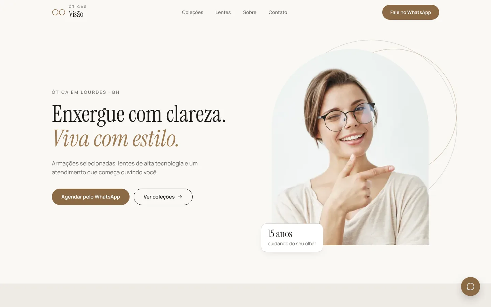
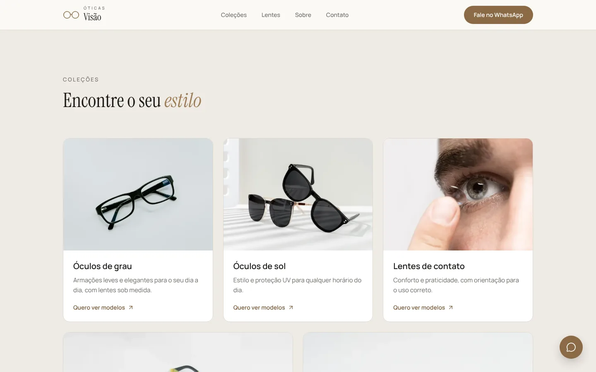
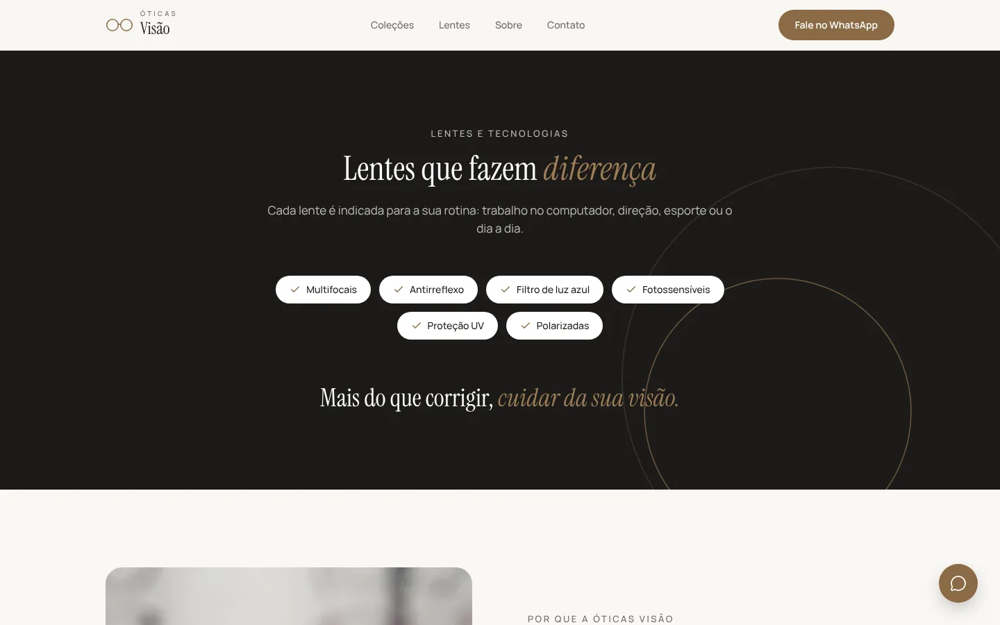
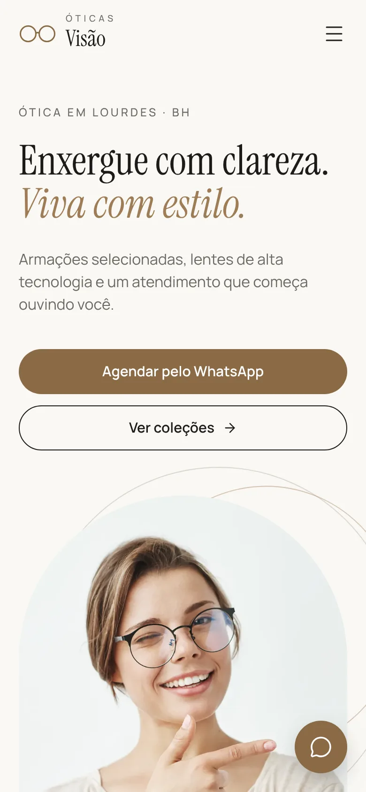
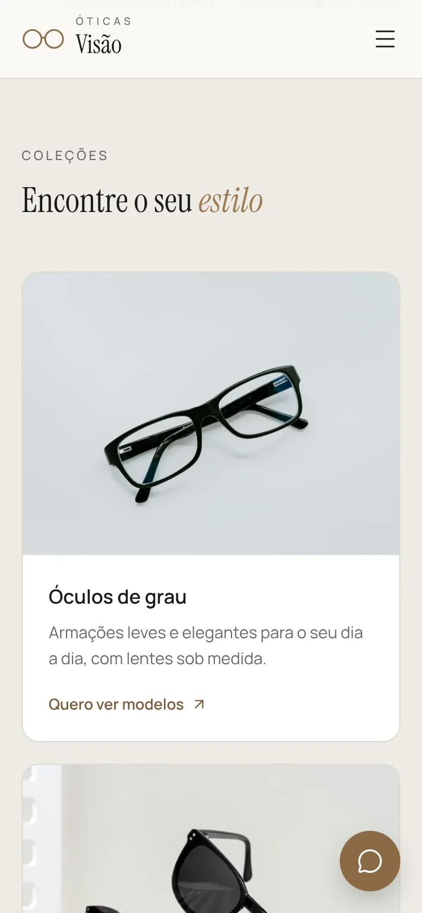

# Óticas Visão

Landing page de uma ótica **fictícia** em Belo Horizonte, criada como projeto de portfólio. Visual moderno e limpo, foco em conversão pelo WhatsApp, acessibilidade e performance.

**Site no ar:** [ticas-vis-o.vercel.app](https://ticas-vis-o.vercel.app)



| Coleções | Lentes e tecnologias |
|---|---|
|  |  |

| Celular: início | Celular: coleções |
|---|---|
|  |  |

## Sobre o projeto

A Óticas Visão é uma marca inventada. O objetivo foi construir uma página de uma só rolagem que apresente a ótica, mostre as coleções e leve o visitante a conversar pelo WhatsApp, com uma identidade visual própria: tons neutros com destaque areia, a sans-serif Manrope e a serifada Instrument Serif em itálico nas palavras de destaque.

**Seções:** início, coleções (grau, sol, lentes de contato, infantil e esportivo), lentes e tecnologias, diferenciais, marcas, depoimentos, sobre o espaço e "Visite-nos" com mapa e horários.

## Destaques

- **Responsivo e mobile-first:** testado em 375, 768 e 1280px, com menu de tela cheia no celular.
- **WhatsApp em toda a página:** botão flutuante e links com mensagem pronta para cada coleção.
- **Animações sutis ao rolar:** feitas só com IntersectionObserver e CSS, sem biblioteca. Respeitam "reduzir movimento" e não causam deslocamento de layout.
- **Acessibilidade:** HTML semântico, link "pular para o conteúdo", foco visível, menu mobile com foco controlado (`inert`), contraste AA conferido e textos alternativos em todas as fotos.
- **Performance:** fotos em WebP com `srcset` (cerca de 430 KB no total), fontes hospedadas no próprio site e carregamento tardio das imagens e do mapa.
- **SEO e compartilhamento:** meta tags, Open Graph com imagem própria e URL canônica preenchida no build da Vercel.
- **Conteúdo centralizado:** todos os textos e dados ficam em `src/data/site.js`, e trocar um texto não exige mexer nos componentes.

### Lighthouse (celular, build de produção)

| Performance | Acessibilidade | Boas práticas | SEO |
|---|---|---|---|
| 98 | 100 | 100 | 100 |

Medido localmente no build de produção. Os valores na Vercel podem variar um pouco.

## Stack

- [React 19](https://react.dev) + [Vite](https://vite.dev)
- [Tailwind CSS 4](https://tailwindcss.com) (tokens de design em `src/index.css`)
- [Lucide](https://lucide.dev) para ícones
- [oxlint](https://oxc.rs) para lint
- Deploy na [Vercel](https://vercel.com)

## Como rodar

```bash
npm install
npm run dev      # servidor local em http://localhost:5173
npm run build    # build de produção na pasta dist
npm run preview  # serve o build localmente
npm run lint
```

## Estrutura

```
src/
├─ components/     # Header, Hero, Collections, Lenses, Benefits, Brands,
│                  # Testimonials, About, Location, Footer, Reveal...
├─ data/
│  ├─ site.js      # textos e dados do negócio (fictícios)
│  └─ images.js    # carrega as fotos WebP e monta o srcset
├─ hooks/
│  └─ useReveal.js # animação de entrada ao rolar
├─ assets/images/  # fotos em WebP, duas larguras cada
└─ index.css       # Tailwind, fontes e tokens de design
public/            # favicon, imagem de compartilhamento, fontes, robots.txt
docs/              # design brief e prints do README
```

## Como editar

- **Textos, contato, horários e depoimentos:** `src/data/site.js`.
- **Cores e fontes:** `src/index.css`, bloco `@theme`.
- **Fotos:** veja `src/assets/images/README.md`. Cada foto tem duas larguras (`nome-600.webp` e `nome-1200.webp`, por exemplo). Sem o arquivo, o site mostra uma ilustração no lugar.
- **URL do site (canonical e Open Graph):** na Vercel é automática. Para um domínio próprio, defina `VITE_SITE_URL` nas variáveis de ambiente.

## Créditos

**Fotos:** licença livre. Na otimização, foram recortadas, convertidas para WebP e tiveram gravações de marcas reais removidas.

| Arquivo | Autor | Fonte |
|---|---|---|
| hero | (a preencher) | (link) |
| colecao-grau | (a preencher) | (link) |
| colecao-sol | (a preencher) | (link) |
| colecao-contato | (a preencher) | (link) |
| colecao-infantil | (a preencher) | (link) |
| colecao-esportivo | (a preencher) | (link) |
| diferenciais | (a preencher) | (link) |
| sobre | (a preencher) | (link) |

**Fontes:** Manrope e Instrument Serif, sob a SIL Open Font License. As licenças estão em `public/fonts/`.

**Ícones:** Lucide, licença ISC.

**Mapa:** Google Maps (incorporação).

## Aviso

Óticas Visão é uma **marca fictícia**. Nome, endereço, telefone, números, depoimentos e marcas citadas foram inventados para este portfólio. O número de WhatsApp não pertence a ninguém.

---

Desenvolvido por Vinicius.
